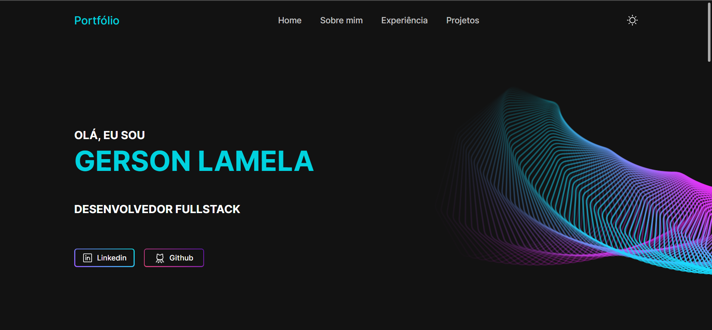

<div  align="center"  id="top">



  

&#xa0;

  

 <a href="https://portfolio-gersonlamela.vercel.app/">Aceda ao Portefófio aqui!</a> 

</div>

  

<h1  align="center">Portfólio</h1>

  


  


  

<hr>

  

<p  align="center">

<a  href="#dart-sobre">Sobre</a> &#xa0; | &#xa0;

<a  href="#rocket-tecnologias">Tecnologias</a> &#xa0; | &#xa0;

<a  href="#white_check_mark-pré-requisitos">Pré requisitos</a> &#xa0; | &#xa0;

<a  href="#checkered_flag-começando">Começando</a> &#xa0; | &#xa0;

<a  href="#memo-licença">Licença</a> &#xa0; | &#xa0;

<a  href="https://github.com/gersonlamela"  target="_blank">Autor</a>

</p>

  

<br>

  

## :dart: Sobre ##

	  Projeto desenvolvido
  
 Portfólio onde podes ver tudo sobre mim, as minhas experiências, os meus projetos e o meu curriculum


  

  
## :rocket: Tecnologias ##

  

As seguintes ferramentas foram usadas na construção do projeto:

  


- [Node.js](https://nodejs.org/en/)
- [React](https://pt-br.reactjs.org/)
- [TailwindCSS](https://tailwindcss.com/)

  

## :white_check_mark: Pré requisitos ##

  

Antes de começar :checkered_flag:, você precisa ter o [Git](https://git-scm.com) e o [Node](https://nodejs.org/en/) instalados em sua maquina.

  

## :checkered_flag: Começando ##

  

```bash
# 1- Clone este repositório
	$ git@github.com:gersonlamela/Portfolio-React.git
# 2- Entre na pasta
	$ cd Portfolio-React
# 3- Instale as dependências
	$ npm i
# 4- Para iniciar a aplicação
	$ npm dev
# O app vai inicializar em <http://localhost:3000>
```

  

  

Feito com :heart: por <a  href="https://pt.linkedin.com/in/gersonlamela"  target="_blank">Gerson Lamela</a>

  

&#xa0;

  

<a  href="#top">Voltar para o topo</a>
